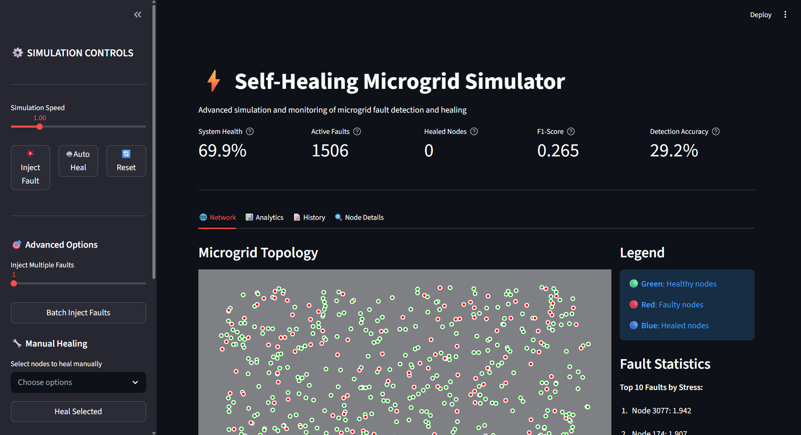
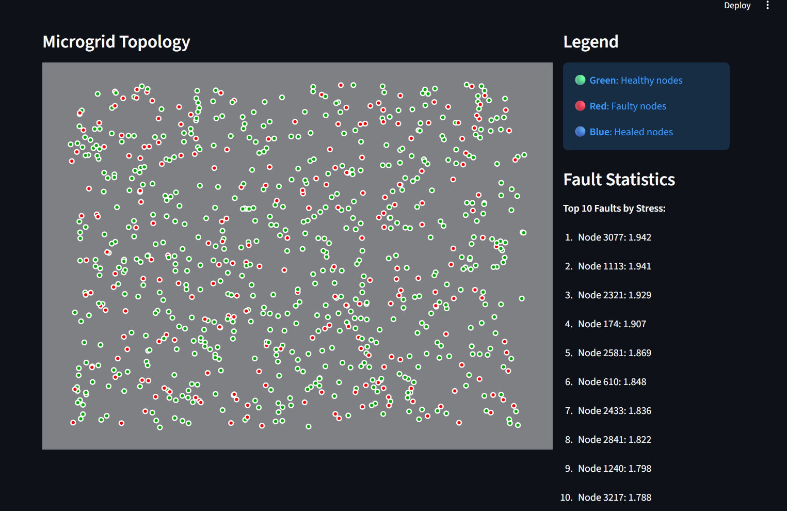
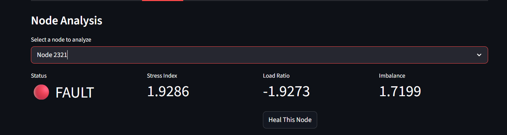
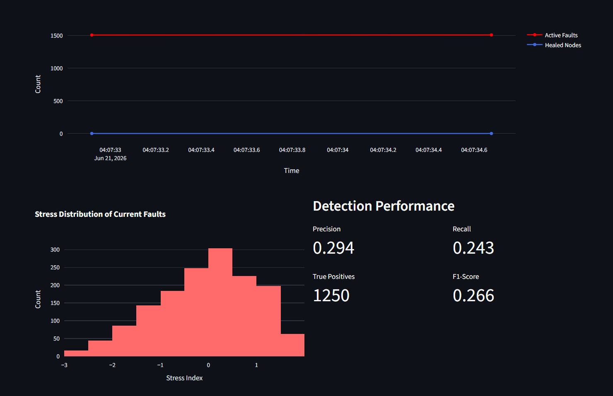
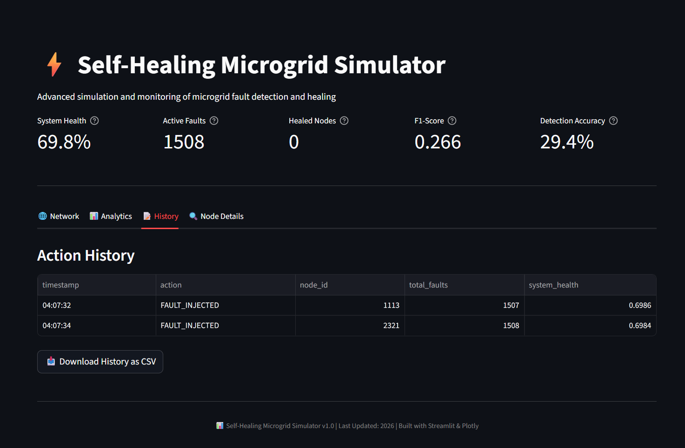

# ⚡ AI Self-Healing Microgrid

An AI-powered Self-Healing Smart Microgrid platform that automatically detects faults, analyzes affected grid nodes, predicts restoration strategies, and restores power distribution using intelligent decision-making.

This project demonstrates how Artificial Intelligence can improve power grid resilience through automated fault detection, topology analysis, node recovery, and performance monitoring.

---

## 🚀 Key Features

### 🔍 Intelligent Fault Detection
- Detects grid failures in real time
- Identifies impacted nodes and affected regions
- Classifies fault severity

### 🧠 AI-Powered Analysis
- Node health evaluation
- Restoration recommendation engine
- Grid topology intelligence

### ⚡ Self-Healing Mechanism
- Automatic restoration workflow
- Recovery path selection
- Service continuity optimization

### 📊 Performance Monitoring
- Real-time system metrics
- Recovery performance tracking
- Grid health visualization

### 🌐 Smart Grid Visualization
- Interactive node topology
- Fault propagation analysis
- Recovery status monitoring

---

# 🏗️ System Architecture

```text
Grid Sensors
      │
      ▼
Fault Detection Engine
      │
      ▼
Node Analysis Module
      │
      ▼
AI Decision Engine
      │
      ▼
Recovery Strategy Generator
      │
      ▼
Self-Healing Execution
      │
      ▼
Power Restoration
```

---

# 🛠️ Tech Stack

## Frontend
- React
- JavaScript
- Tailwind CSS
- Recharts

## Backend
- Python
- FastAPI

## AI & Analytics
- Machine Learning
- Predictive Analysis
- Fault Classification

## Visualization
- Interactive Dashboard
- Grid Topology Mapping
- Performance Analytics

---

# 📸 Screenshots

## Dashboard



Real-time overview of grid health, active faults, recovery status, and operational metrics.

---

## Grid Topology



Visualization of interconnected grid nodes and power flow paths.

---

## Node Analysis



Detailed analysis of affected nodes, fault impact, and recovery recommendations.

---

## Performance Monitoring



Tracks restoration efficiency, recovery speed, and system performance metrics.

---

## Recovery History



Historical view of faults, restoration actions, and recovery outcomes.

---

# 📈 Project Workflow

1. Grid continuously monitors node health.
2. Fault is detected automatically.
3. Impacted nodes are analyzed.
4. AI evaluates restoration options.
5. Best recovery strategy is selected.
6. Self-healing mechanism executes restoration.
7. Performance metrics are updated.

---

# 🎯 Business Impact

- Reduces power outage duration
- Improves grid reliability
- Enables autonomous recovery
- Minimizes operational intervention
- Enhances smart grid resilience

---

# 📊 Expected Results

| Metric | Improvement |
|----------|----------|
| Fault Detection Speed | High |
| Recovery Time | Reduced |
| Grid Reliability | Improved |
| Service Availability | Increased |
| Manual Intervention | Minimized |

---

# 🔮 Future Enhancements

- Deep Reinforcement Learning (DRL)
- Graph Neural Networks (GNN)
- Predictive Fault Forecasting
- Real-Time IoT Sensor Integration
- Renewable Energy Optimization
- Digital Twin Simulation

---

# ▶️ Run Locally

## Backend

```bash
cd backend
pip install -r requirements.txt
uvicorn main:app --reload
```

## Frontend

```bash
cd frontend
npm install
npm run dev
```

---

# 👨‍💻 Author

Divyanshu Mishra

---

# ⭐ Highlights

- AI-Powered Smart Grid
- Self-Healing Infrastructure
- Real-Time Monitoring
- Automated Recovery
- Fault Analytics Dashboard
- Enterprise-Style Architecture